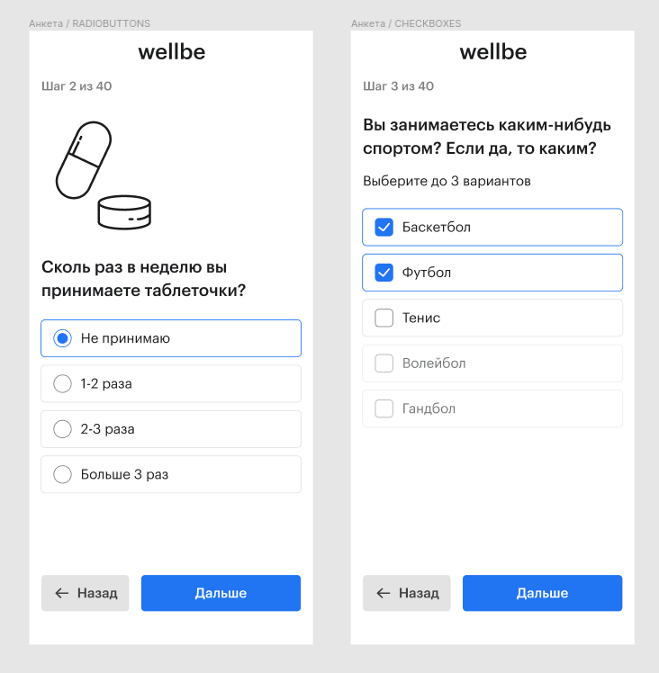

Анкета Wellbe - это входная точка в сервис. С ее помощью мы сканируем клиента, чтобы в дальнейшем подобрать ему подходящие товары.

Конечно, существует огромное множество конструкторов анкет, но в нашем случае нам нужна была максимальная гибкость, чтобы подстраиваться под любые требования бизнеса.

## Что нам нужно было реализовать. Требования к анкете.
С помощью анкеты мы знакомим клиента с сервисом и собираем данные, для подбора витаминов. У нас был приблизительные набор функциональных требований к анкете:
1. Ветвления в зависимости от ответов
2. Возможность вставлять картинки в вопросы
3. Использование переменных
4. Алгоритм подбора товаров должен работать на основе ответов анкеты

## Аналоги
Так как анкета - это не что-то супер новое, мы решили изучить другие решения. Мы проанализировали анкеты как известных конструкторов (TypeForm, Google Forms), так и аналогичных сервисов, таких как Halsa и Care/Of.

Изучение Care/of помогло нам расширить функциональные требования. Мы увидели, что в анкете отлично смотрятся вставки с анимациями, а так же смогли оценить, какой объем контента должна помещать анкета. Изучение API TypeForm помогло выстроить архитектуру нашей анкеты.

## Дизайн анкеты

Перед проектировкой архитектуры мы решили нарисовать макеты нашей будущей анкеты. Выяснилось, что на старте нам нужно около 6 типов экранов
- Ввод текста
- Чекбоксы
- Радиобатоны
- Вводные страницы
- Авторизация по телефону
- Лоадер

У нас не было времени делать десктоп и мобайл версии, поэтому мы старались чтобы анкета выглядела хорошо на любом экране. 

